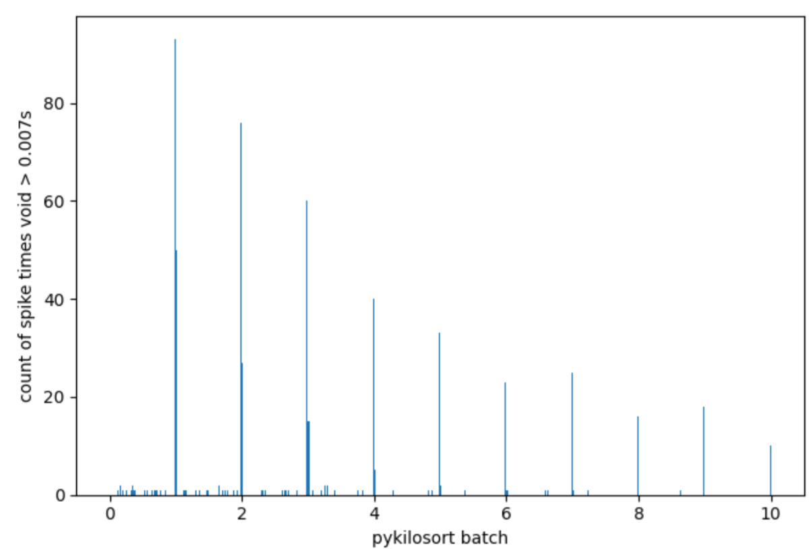
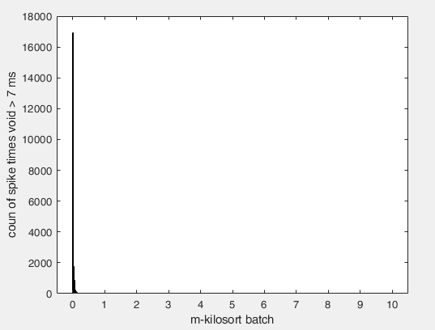

# Detecting "Spike Holes"

Kilosort bug in versions 2.5 and 3:

As raw electrophysiology data is heavy, the spike sorting algorithm (Kilosort) truncates it into smaller portions (called batches) to work with.

To ensure information continuity, the edges of these batches are processed slightly differently than the middle portion of the batch. They found that at the edge of the spike sorting batches, ~7ms of spikes go undetected. They call this effect "spike holes."

Reference: [Github_Kilosort](https://github.com/MouseLand/Kilosort/issues/594)

## Method
The script generates a histogram to show the spike holes for the kilosort batch and quantify the result, telling you whether you have "spike holes" in your data.

**Figure:** Histogram of the ratio between interspike intervals and the batch size. The used interspike intervals are longer than 6.5 ms. If the histogram shows higher values in the integers (1,2,3,...), it means that there are "spike holes" between the batches. 

Example from Kilosort bug:



Method used in one of our sessions:




## How to use it

If you add the script to your pathway:
1) Execute the script:

```matlab
Spike_hole_detection
```
2) Then, you have to select the folder where you have the files generated by kilosort for the session that you want to test.

3) The script will generate the plot of the Method explained and it will display the message with the result:

   - There are spike holes: "I am sorry, you have spike holes"

   - There aren't spike holes: "Everything is Okey, you can continue analyzing"
   - 
=======

